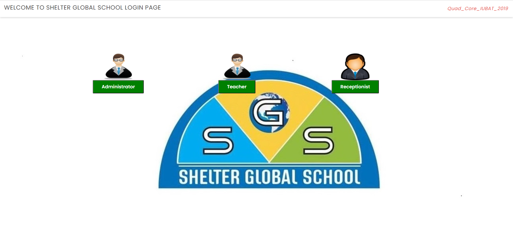
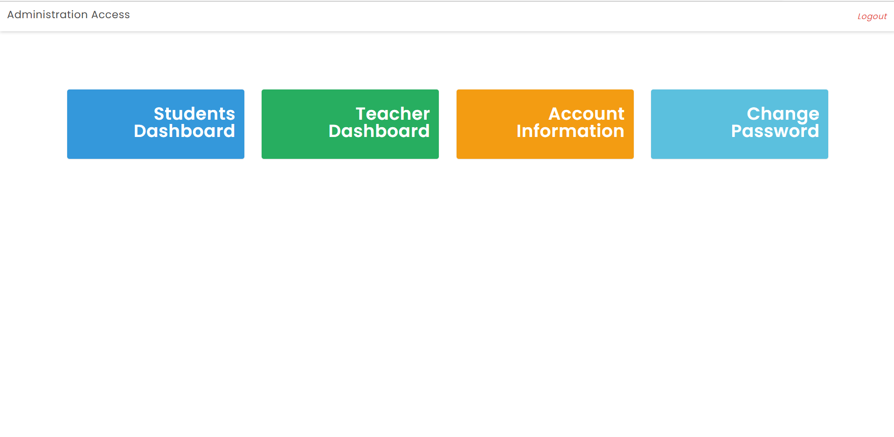
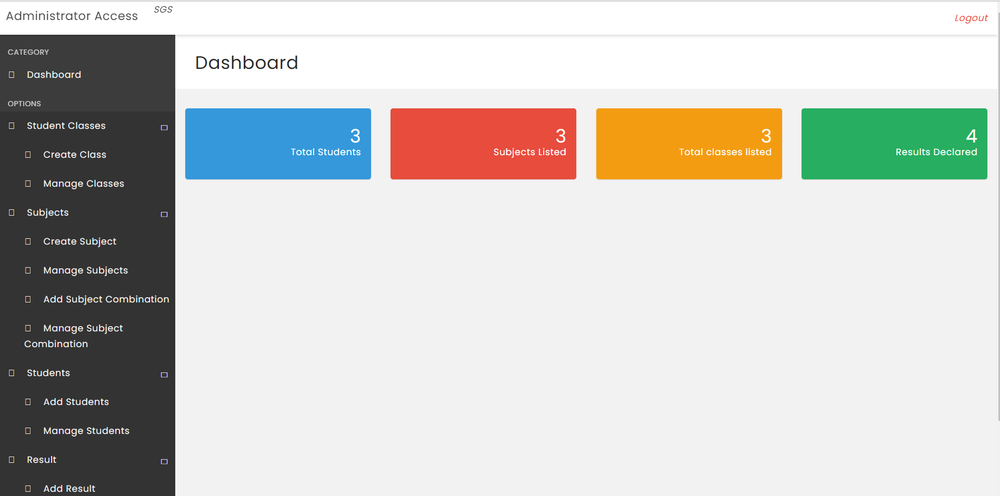
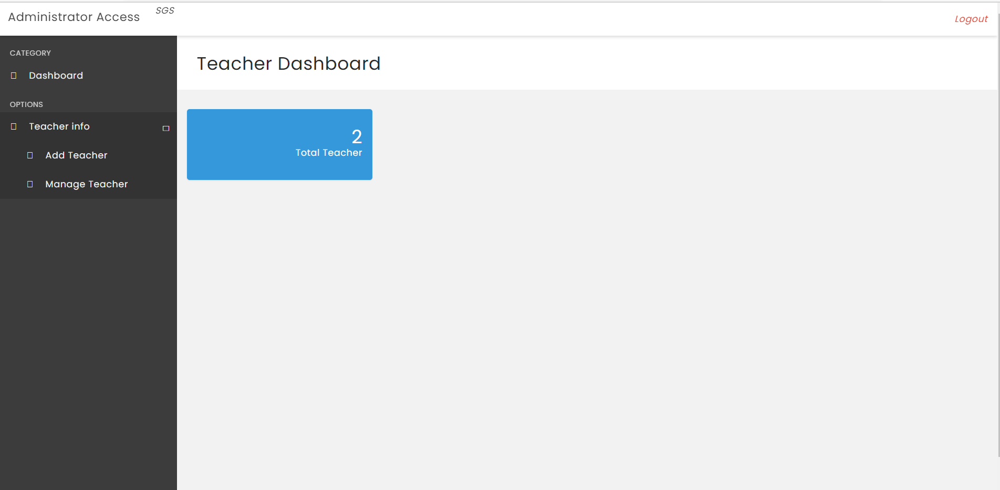
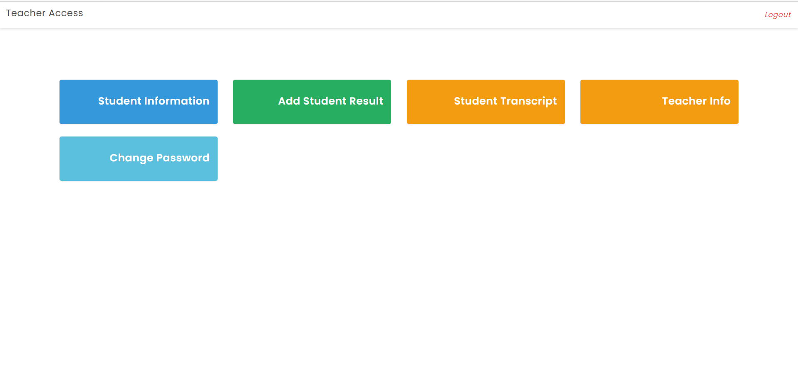
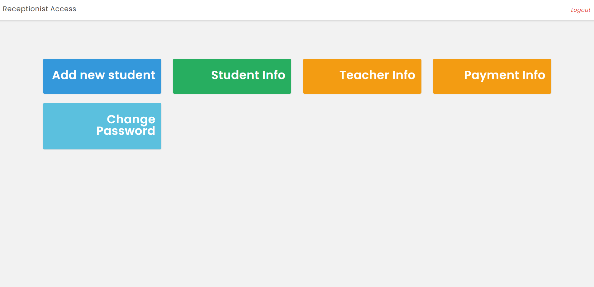

# School_Management_System Using PHP.

This Project is about the Shelter Global School Project.Here ,the I use Html, CSS, JavaScript ,PHP ,MySql ,JQuery. .Before Enter to the project at first insert the database into the sql database.Database file is given inside the project.

## Here, I am trying to do this project using core php .

##### This project had been done for the requirements System Analysis Courses which is done in (25-09-2019  to 03-12-2019).

#### Peoject Description: This Project is all about the school management system.Through doing this project I started to make software. This Project is not well enough.On that time I tried very hard to do this project.

#### Credits : This is basically a group project. Some login part, Database table structure and some logic provied by Md.Rakibuzzaman,Shoibe Akter and Abdur Rahman. And Rest of the part had done by me.

##### Note: This Project is Not fully Responsive 

##### For log in or you can Registration 

For Admin Login UserName: admin 
                Password: 1234

For Teacher Login UserName: teacher
               Password:1234

For Receptionist Login UserName: receptionist
               Password:1234

#### Some Samples of this project is given below :

